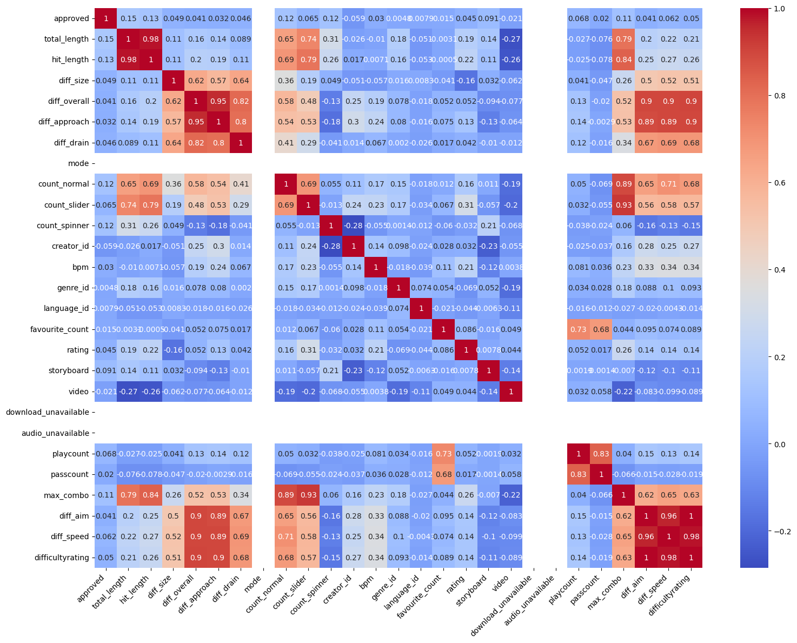

# Osu 
Osu is a rythm game where the goal is to click circles to the beat.
All of the beatmaps are made by the community and are free to download.

The goal here is to make some statistics and visualizations about those beatmaps, and find correlation between variables.

## Data

The [data](https://www.kaggle.com/datasets/alumkal/osu-beatmaps) is from Kaggle. It contains more than 100 000 rows, and has 44 columns :

- `split` :
- `audio_hash` :
- `beatmap_id` : The id of the beatmap.
- `approved` : 1 if the map is in an approved state, 0 otherwise.
- `total_length` : Total length of a beatmap in seconds.
- `hit_length` : Total length minus the length of the breaks in seconds.
- `version` : The version/mapset of the beatmap.
- `file_md5` :
- `diff_size` : The size of the circles.
- `diff_overall` : The precision required to click in time a circle.
- `diff_approach` : The approach rate.
- `diff_drain` : The drain rate.
- `mode` : The mode of the beatmap (osu, taiko, catch, mania).
- `count_normal` : The number of circles.
- `count_slider` : The number of sliders.
- `count_spinner` : The number of spinners.
- `approved_date` : The date the map was approved.
- `last_update` : The date the map was last updated.
- `artist` : The artist of the song.
- `artist_unicode` : The artist of the song in unicode.
- `title` : The title of the song.
- `title_unicode` : The title of the song in unicode.
- `creator` : The creator of the map.
- `creator_id` : The id of the creator.
- `bpm` : The BPM of the song.
- `source` : 
- `tags` : The tags of the beatmapset
- `genre_id` : The id of the genre of the song.
- `language_id` : The id of the language of the song.
- `favourite_count` : The number of times the map was favourited.
- `rating` : The rating of the map from 0 to 10.
- `storyboard` : 1 if the map has a storyboard, 0 otherwise.
- `video` : 1 if the map has a video, 0 otherwise.
- `download_unavailable` : 1 if the map is not downloadable, 0 otherwise.
- `audio_unavailable` : 1 if the audio is not available, 0 otherwise.
- `playcount` : The number of times the map was played.
- `passcount` : The number of times the map was passed.
- `packs` : The number of packs the map is in.
- `max_combo` : The maximum combo possible.
- `diff_aim` : The aim difficulty in the overall difficulty.
- `diff_speed` : The speed difficulty in the overall difficulty.
- `difficultyrating` : The difficulty rating of the map.

The dataset was cleaned and preprocessed before being used for the analysis.

## Correlations

In this heatmap, we can see correlation between :
- `total_length` and 
  - `max_combo` which is expected as longer maps have more opportunities to get a higher combo.
  - `count_slider` and `count_normal` which is expected as longer maps have more opportunities to have more sliders and objects
  - `hit_length` which there is no need to explain why this is correlated
- `diff_size` and
  - `diff_drain` which is expected as higher drain rate means higher difficulty in general
  - `diff_overall` which is expected as higher overall difficulty means higher difficulty in general
- `diff_overall` and
  - `difficultyrating` which is expected, as the more precise you need to be rythmically, the harder the map is
  - `diff_speed` which is expected as higher speed difficulty means higher difficultyrating
  - `diff_aim` which is expected as higher aim difficulty means higher difficultyrating
  - `max_combo` but in a less important way, as the combo is not the only thing that makes a map hard
  - `count_slider` and `count_normal` which is expected as the last attribute is correlated with the overall difficulty
  - `diff_drain` which is expected as higher drain rate means higher difficultyrating
  - `diff_approach` which is expected as the easiest maps have generaly ar=2-5, and the harder maps above ar=9
- `diff_approach` and all of the above for difficulty
- `diff_drain` and all of the above for difficulty
- `favorite_count` and
  - `passcount` and `playcount` which is expected as the more a map is played, the more it is likely to be favourited

Generally, we can observe that the biggest correlations are kind of expected, but we could have expected some other that are not here. For example, the bpm isn't correlated with any of the difficulty stats, even though there is a speed difficulty.
This could be because the speed difficulty is calculated with something else than just the bpm alone. In fact the speed difficulty seams to be more related with the number of objects, which is normal because we call a map a speed map when there are a lot of fast streams in it (which is not the case when we have a high bpm map with no streams).
We also wanted to see the correlation between the difficulty and the popularity of the beatmap, and to our suprise it is not correlated to anything.